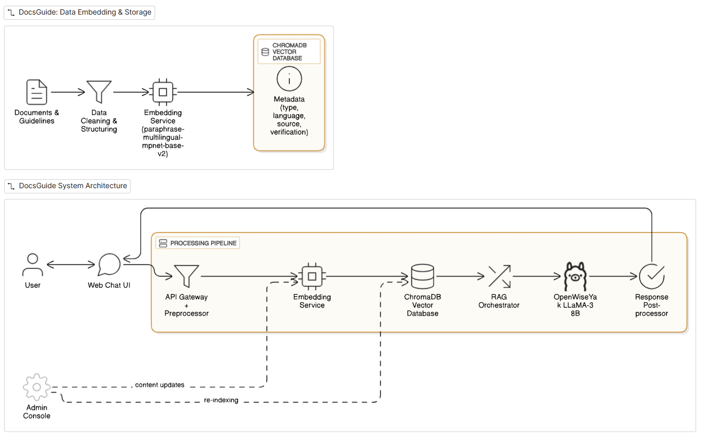

# DocsGuide

**DocsGuide** is a bilingual AI assistant that helps people navigate Nepali government document procedures. It uses retrieval-augmented generation (RAG) to provide step-by-step answers grounded in verified official documents, with source citations.

## Features

- Nepali and English conversations
- Hybrid dense + BM25 retrieval with multilingual reranking
- Citation-aware answers grounded in retrieved documents
- FastAPI backend and Next.js frontend
- Evaluation notebooks for citizenship and passport questions

## Architecture

```text
User → Next.js frontend → FastAPI API
                          ├─ Pinecone hybrid retrieval
                          ├─ Nepali embedding model
                          ├─ BM25 sparse retrieval
                          ├─ Multilingual reranker
                          └─ Gemini response generation
```

### System design



## Repository layout

```text
.
├── frontend/                 # Next.js and Tailwind web client
├── data/                     # Processed document chunks and QA fixtures
├── src/
│   ├── server/               # FastAPI application
│   ├── retriever/            # Hybrid retrieval and reranking
│   ├── generator/            # LangGraph response generation
│   ├── embeddings/           # Embedding utilities and BM25 parameters
│   ├── preprocessing/        # Document chunking and metadata mapping
│   └── *.ipynb               # End-to-end experiments and evaluations
├── docs/                     # Design documents, proposal, and presentation assets
├── scripts/                  # Local automation entrypoints
└── .github/workflows/        # Continuous integration
```

## Quickstart

### Requirements

- Python 3.10+
- Node.js 18+
- Pinecone account and index
- Google Gemini API key

### Backend

```bash
cd src
python -m venv .venv
source .venv/bin/activate
pip install -r requirements.txt
```

Copy `src/.env.example` to `src/.env` and fill in your credentials:

```env
PINECONE_API_KEY=your_pinecone_key
GOOGLE_API_KEY=your_gemini_key
ALLOWED_ORIGINS=http://localhost:3000
```

Run the API from the repository root:

```bash
./scripts/run_backend.sh
```

The API is available at <http://localhost:8000/docs>.

### Frontend

```bash
cd frontend
npm install
npm run dev
```

The web client is available at <http://localhost:3000>.

For a deployed frontend, copy `frontend/.env.example` to
`frontend/.env.local` and set `NEXT_PUBLIC_API_URL` to the public API URL.

## Deployment

The repository includes deployment manifests for the two-service setup:

- **Backend:** deploy the root `Dockerfile` with `render.yaml` on Render. Set
  `PINECONE_API_KEY`, `GOOGLE_API_KEY`, and `ALLOWED_ORIGINS` in the service
  environment.
- **Frontend:** import the repository into Vercel with the project root set to
  `frontend`, then set `NEXT_PUBLIC_API_URL` to the deployed backend URL.
- **Hugging Face:** the Dockerfile also supports a Docker Space and uses the
  platform-provided `PORT`. Add the API keys as Space Secrets and set
  `ALLOWED_ORIGINS` to the frontend URL.

The backend loads the embedding and reranker models at startup, so choose a
host plan with enough memory for the model dependencies.

Hugging Face Static Spaces are free, but they cannot run this Python backend.
Docker or Gradio Spaces need compute access; free-account availability and
hardware limits are controlled by Hugging Face. A free static frontend still
needs a separately hosted API to answer questions.

## Evaluation data

- 28 QA pairs for evaluation
- 15 QA pairs for testing
- Manually labeled chunks used as ground truth
- 43 real-world citizenship and passport queries in total

## Performance

Our best hybrid-search configuration uses a 50/50 dense/sparse split, document-type filtering, and reranking:

| Metric | Evaluation | Test |
| --- | ---: | ---: |
| Answer correctness | 85.77% | 89.30% |
| Recall@7 | 90.23% | 88.90% |

These results use a small manually labeled benchmark and should be treated as an initial project baseline.

## Configuration and security

- Never commit `.env` files, API keys, Pinecone credentials, or generated vector databases.
- Set `NEXT_PUBLIC_API_URL` in `frontend/.env.local` when the API is not running on localhost.
- The assistant is informational and does not replace official government guidance. Users should verify requirements with the linked source documents.

## Attribution

This repository is a structured copy of the original DocsGuide project by the FuseAI Fellowship team. See the project documentation in `docs/` for the proposal, literature review, system design, and defense materials.

## Team

Built by **Andis Paudel**, **Bikash Pokhrel**, **Dipin Adhikari**, and **Utsab Dahal**.
